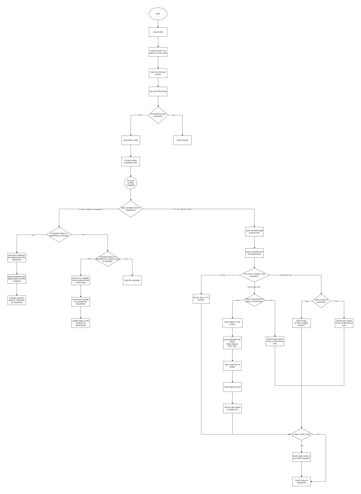

[![LinkedIn][linkedin-shield]][linkedin-url]

<!-- PROJECT LOGO -->
 

  
  <h3 align="center">NTRA Fraud Portal Automation Robot</h3>

<!-- TABLE OF CONTENTS -->

  
Table of Contents

  <ol>
    <li>
      <a href="#about-the-project">About The Project</a>
      <ul>
        <li><a href="#business-case">Business Case</a></li>
        <li><a href="#technical-solution">Technical Solution</a></li>
        <li><a href="#flowchart">Flowchart</a></li>
        <li><a href="#tech-stack">Tech Stack</a></li>
      </ul>
    </li>
    <li><a href="#contact">Contact</a></li>
  </ol>

<!-- ABOUT THE PROJECT -->
## About The Project

* Project Name: NTRA Fraud Portal Automation Robot
* Version: v1.0.289
* Organization Department: Technology

### Business Case

Handling fraud complaints efficiently is critical to maintaining compliance and meeting SLAs with regulatory bodies such as the NTRA. This project automates the process of managing fraud cases submitted by customers, significantly reducing the manual workload and response times.

When a fraud complaint is filed, it is sent to the NTRA, which in turn assigns the case to the internal Fraud Portal. Timely resolution of these cases is essential to avoid penalties and ensure customer satisfaction. This automation robot streamlines the process by automatically handling the entire lifecycle of each case, from retrieval to resolution, ensuring compliance with SLAs and providing prompt feedback to customers.

(<a href="#readme-top">back to top</a>)

### Technical Solution

The NTRA Fraud Portal Robot operates on a 10-minute interval, ensuring that no new cases go unaddressed for long periods. Key steps in the automation process include:

* Case Extraction: The robot accesses the NTRA portal and retrieves newly assigned fraud cases.
* Data Handling: It gathers all relevant details and attachments for each case.
* Case Creation in Internal System: Each case is added to the internal SharePoint list used by the fraud team.
* Automated Investigation: The robot interfaces with the internal CRM (Siebel) to investigate cases and generate immediate feedback, including screenshots as proof of the investigation.
* Resolution Verification: For reassigned cases, the robot checks the resolution status in the SharePoint list and, if resolved, responds to the NTRA portal with the necessary feedback and attachments.

(<a href="#readme-top">back to top</a>)

### Flowchart

(<a href="#readme-top">back to top</a>)

### Tech Stack

This project was developed using the following tech stack:

* UiPath
* Python

(<a href="#readme-top">back to top</a>)

<!-- CONTACT -->
## Contact

Mohamed AbdelGawad Ibrahim - [@m-abdelgawad](https://www.linkedin.com/in/m-abdelgawad/) - <a href="tel:+201069052620">+201069052620</a>

(<a href="#readme-top">back to top</a>)

<!-- MARKDOWN LINKS & IMAGES -->
[linkedin-shield]: https://img.shields.io/badge/-LinkedIn-black.svg?style=for-the-badge&logo=linkedin&colorB=555
[linkedin-url]: https://www.linkedin.com/in/m-abdelgawad/
